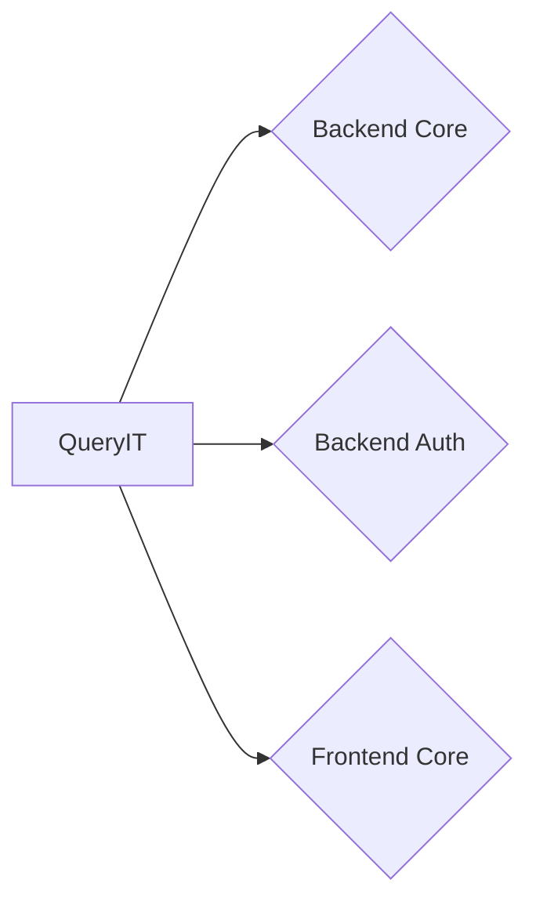

# QueryIT
QueryIT is a platform used to manipulate data from a database.

Due the fact that is a faculty project, I tried to implement as much as possible, most of the technologies which are used to perform a stable project, using latest versions.

Stack used in this project is:

* Java with Spring, Spring Boot, to perform backend part
* Database is a PostgreSQL, connected using Hibernate and HikariCP (Already implemented by Spring). To acces data from database I used JPA Repositories. I wanted to version database, so I used flyway for that. When application runs, flyway make a call to .sql files. Flyway run then and is database is populated with tables and data. 
* Typescript with Angular, to perform frontend part
* I wanted to containerize the app, so I used Docker for that. Due the fact I needed a database, I host database on docker, using one container and another for running the app. This thing is possible having a docker-compose, a thing that Docker uses if I want to have more containers for an app.

QueryIT is based on microservices, is not a monolith and looks like that:

Every microservice is part of this project as submodule and can be found on the project, if you click on them and you will be redirected to their repositories where you will found files of every microservice.

I wanted to have some reports about code and in every microservice you will found Code Quality Core and Code Grade, performed by Codiga.

When I writed code, I was careful to avoid some [pitfalls](https://thorben-janssen.com/lombok-hibernate-how-to-avoid-common-pitfalls/):
- Don’t Use @EqualsAndHashCode
- Be Careful with @ToString (Not use on @OneToMany and @ManyToOne)
- Avoid @Data
- Every Entity class should implement Serializable